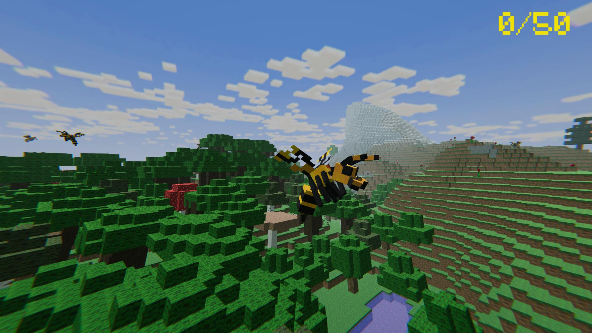
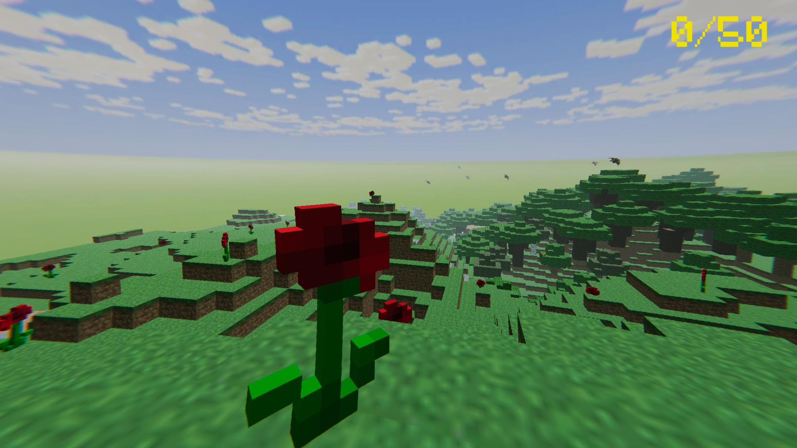
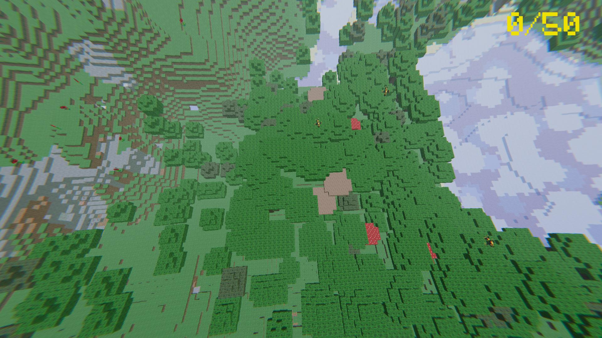

# Bumble_Bee

**Bumble_Bee** is a Minecraft-style open-world game built in **Unity**. Navigate a voxel-style garden, collect honey from flowers, and survive attacks from territorial wasps.

## Gameplay

The goal is simple: Collect honey and survive!
Explore a procedurally generated voxel garden, gather nectar from flowers, and avoid the aggressive wasps patrolling the skies.

## Interaction

- **Bee (Player)**:
  - Uses physics-based flight mechanics to navigate.
  - Can hover, sprint, and bank while turning.
  - Collects honey by flying into flowers.
- **Wasps (Enemy)**:
  - Patrols the area randomly.
  - Chases the player if they get too close (Aggro range).
  - Touching a wasp results in an immediate Game Over.

## Features

- **Procedural Generation**: Flowers and wasps are spawned dynamically on valid terrain.
- **Open World**: A vast voxel environment with "grass" and "lawn" surfaces.
- **Dynamic AI**: Wasps switch between "Roaming" and "Chasing" behaviors.

## Tech Stack

- **Engine**: Unity 3D
- **Language**: C#

## Project Structure

- `Assets/Scripts/BeeBehaviour.cs`: Controls player flight physics and interactions.
- `Assets/Scripts/WaspBehaviour.cs`: Manages enemy AI logic (Patrol/Chase).
- `Assets/Scripts/FlowerSpawner.cs`: Procedurally places flowers across the map.

## Script Reference

### Gameplay
- **`BeeBehaviour.cs`**: The main player controller. Handles input for acceleration, turning, and vertical movement. Detects collisions with enemies.
- **`HoneyManager.cs`**: Singleton that tracks the total honey collected and determines the win condition.
- **`UIManager.cs`**: Manages the in-game HUD (honey counter) and Game Over screens.

### Environment & AI
- **`WaspBehaviour.cs`**: Finite State Machine for enemies. Handles roaming logic and detects the player to initiate a chase.
- **`FlowerSpawner.cs`**: Scans the terrain for valid surfaces and spawns flowers at the start of the game.
- **`WaspZoneSpawner.cs`**: Spawns a set number of wasps within a defined volume, ensuring they don't start too close to the player.

### Audio
- **`AudioManager.cs`**: Persists background music and handles sound settings across the game.

## Gallery

| | |
|:---:|:---:|
|  |  |
|  |  |

## License

This project is licensed under the MIT License - see the [LICENSE](LICENSE) file for details.
Copyright (c) 2026 ARGUS